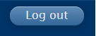

# Web button learning task

## Assignment

```{exercise}
**Observe how "web buttons" are styled on sites you visit regularly.**

Find a "web button" style you particularly like and post a link to the website that contains it. Include a description of the "web button" location on the page and a short statement on why you picked this button.

I will review and pick the best examples to deconstruct in class. You can choose a button style you would like on your website.

An example of a web button (albeit an unstylish one) would be the old log out button in Learning Suite:



You will earn 5 extra credit points if you embed an image of the button in your post.

We will deconstruct several of the stylings in class.
```

## Rubric

```{admonition} Rubric

5 - includes a website URL, description of button location on web page, and short statement on why you picked this button

4 - missing short statement on why you picked this button

3 - no description of button location

2 - missing or inaccessible website URL

1 - cat meme posted instead of assignment

0 - no post or late post


Extra credit:

+5 - satisfies above requirements (earns a 5) and also includes an image of the button in the post
```
